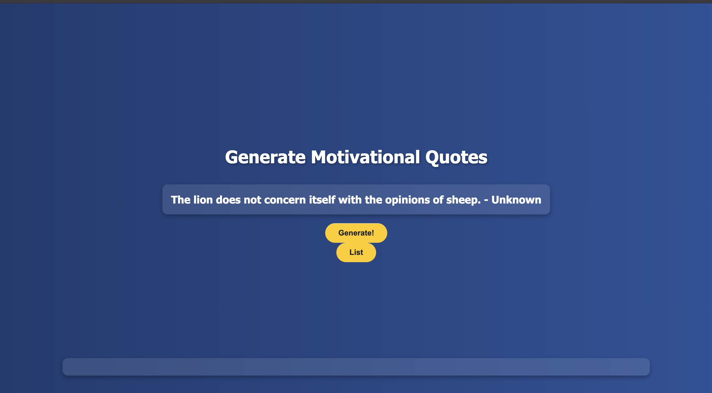

# 🌟 Quote Generator Website

Welcome to my very first project using **HTML**, **CSS**, and **JavaScript**! This simple yet fun project displays random quotes to inspire and motivate, and it helped me understand the basics of web development.

## 🚀 Features

- Generates random inspirational quotes at the click of a button  
- Clean and responsive UI  
- Built using vanilla HTML, CSS, and JavaScript – no libraries or frameworks

## 🎯 Purpose

This was my first hands-on experience with web development. The goal was to:

- Practice structuring content with HTML  
- Style a simple layout using CSS  
- Add interactivity with JavaScript

## 🛠️ Tech Stack

- **HTML** – for the page structure  
- **CSS** – for styling and layout  
- **JavaScript** – for logic and interactivity

## 📸 Screenshot

!(Screenshot of the Lists Section(lists.png)

## 📂 How to Use

1. Clone or download the repository  
2. Open `index.html` in your browser  
3. Click the **"New Quote"** button to see a random quote appear!

## 📌 Future Improvements

- Add animations or transitions  
- Include more quotes or fetch them from an external API  
- Add a “Copy to Clipboard” or “Share” feature  
- Improve mobile responsiveness

---

💡 *Thanks for checking out my first web project! More to come as I continue learning.*
